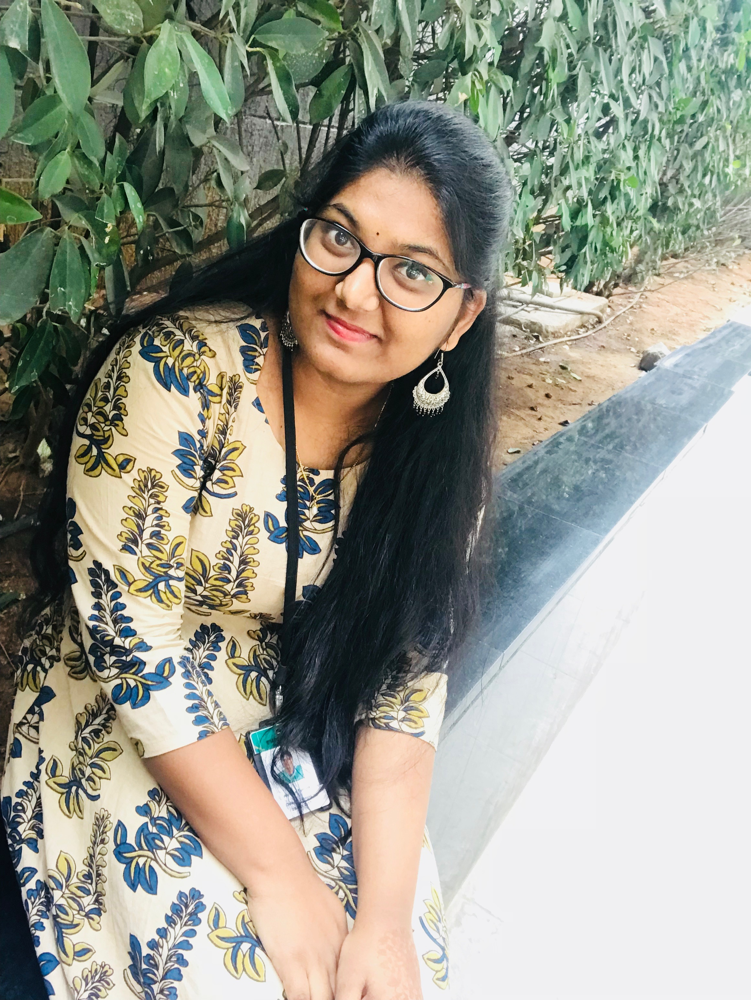

# Akhitha Tumula
## Current
- I am currently pursuing Masters in Applied  Computer science
## Background
1. I was born in Hyderabad and pursued my bachelors in Information Technology from sreenidhi institute of science and technology in the year of 2017.
2. I had almost 2 years of experience in Accenture as a front end developer.
## Plans
- After completing my masters I would like to work as a full-stack developer.
## Links
you can connect me through [linkedin](https://www.linkedin.com/in/akhitha-tumula-8a5aba191/)

